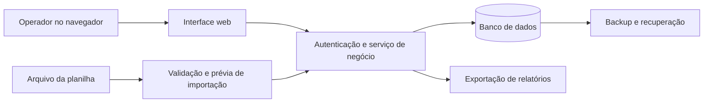

# Gestão de armários — auditoria e proposta de evolução

Data: 22/09/2026. Documento de discussão arquitetural, sem implementação.

## 1. Minha recomendação

Eu criaria um aplicativo web com banco de dados próprio, capaz de importar a planilha existente e exportar relatórios. O sistema passaria a controlar pessoas, vagas e movimentações. A planilha continuaria útil como entrada de dados e formato de intercâmbio.

Seu código já expressa conhecimento operacional: existem vagas compartilhadas, pessoas com cadastro incompleto, categorias especiais, transferências e necessidade de histórico. Esse conhecimento merece ser preservado. O principal trabalho da evolução será tornar essas regras explícitas e garantir que sejam respeitadas em todas as operações.

Ter uma tela fora do Google Sheets é possível mesmo mantendo a planilha como armazenamento. Porém, para uma ferramenta usada por mais de um operador, recomendo que o banco próprio seja o responsável pelos dados operacionais. Isso facilita impedir duas ocupações na mesma vaga e concluir uma transferência integralmente.

O navegador é uma boa primeira escolha: permite acessar o mesmo sistema de computadores diferentes e dispensa distribuir instaladores. Uma aplicação instalada ou funcionamento offline podem ser avaliados se o ambiente exigir. Por enquanto, não há motivo identificado para assumir essa complexidade.

**Hipótese de trabalho, ainda não confirmada:** uso interno em uma unidade, com poucos operadores e conexão disponível. A proposta considera essa hipótese e indica onde decisões diferentes alteram a arquitetura. Não estou presumindo um produto comercial para várias empresas.

## 2. Alcance da análise

A análise foi feita sobre o JavaScript colado na conversa. A pasta de trabalho estava vazia, e não foram encontrados arquivos locais `AGENTS.md` ou `RTK.md` nos caminhos ancestrais consultados. A referência a `RTK.md` foi verificada, mas seu conteúdo não estava disponível.

O arquivo `painel_armarios`, as fórmulas, as proteções e os dados reais da planilha não foram fornecidos. Portanto:

- Os achados abaixo descrevem caminhos possíveis no código, sem afirmar que já ocorreram incidentes.
- Não foi possível avaliar layout, acessibilidade, renderização de observações ou validações feitas pelo frontend.
- Não foi executado o Apps Script nem realizado teste na planilha real.
- Ausência de autenticação explícita neste trecho não prova que a planilha esteja pública: o acesso atual também depende das permissões do Google e do contexto de execução.
- Os escapes e entidades presentes no texto da conversa foram tratados como formatação da mensagem, não como defeitos confirmados do arquivo original.

## 3. O que vale preservar

- A ideia de centralizar a classificação no backend em `_processarArmario`.
- A identificação de uma posição por armário e vaga, embora precise de identidade própria no novo modelo.
- As operações de ocupar, liberar e transferir, que já correspondem ao trabalho diário.
- A consulta de colaboradores por matrícula, reduzindo digitação.
- A intenção de registrar histórico e confirmar operações sensíveis.
- O cuidado com leituras repetidas e processamento em lote.

Eu reaproveitaria essas intenções e as transformaria em regras verificáveis. As chamadas a `SpreadsheetApp`, os diálogos da planilha e a formatação do dashboard pertencem ao ambiente antigo e seriam substituídos.

## 4. Achados da auditoria

### Prioridade alta — integridade da ocupação

| Achado | Evidência no código | Consequência possível | Requisito para o aplicativo |
|---|---|---|---|
| Duplicidade não é barrada pela operação de gravação | `processarCadastroPainel` não chama nem incorpora obrigatoriamente `verificarDuplicidade`; procura origem apenas quando `confirmarTransferencia` é verdadeiro | Uma chamada pode cadastrar a mesma matrícula em duas posições | Validar a regra dentro da operação de negócio e garanti-la também no banco |
| Destino pode ser sobrescrito | `processarCadastroPainel` grava sem exigir confirmação de substituição nem verificar o ocupante esperado | Um cadastro substitui outra pessoa sem registrar corretamente a saída dela | Separar edição, ocupação, transferência e substituição; rejeitar destino ocupado por padrão |
| Transferência é uma sequência de gravações independentes | Limpa a origem antes de concluir destino e histórico | Uma falha intermediária pode deixar a pessoa sem alocação ou produzir histórico inconsistente | Executar origem, destino e auditoria na mesma transação |
| Operadores podem competir pela mesma vaga | Não há bloqueio de seção crítica nem verificação de versão no trecho | Dois operadores leem a vaga livre e gravam sucessivamente; um resultado sobrepõe o outro | Controle de concorrência e restrição de uma ocupação ativa por vaga |
| Vaga omitida tem significado ambíguo | `ocuparArmario` aceita qualquer vaga quando `vagaDestino` está vazia e mantém a última coincidência; `liberarArmario` para na primeira | Ocupar e liberar o mesmo número podem atingir vagas diferentes de um armário duplo | Exigir seleção inequívoca da vaga; nunca escolher pela ordem das linhas |

Uma confirmação na interface não resolve concorrência: entre abrir a confirmação e clicar em salvar, outro operador pode alterar o destino. O servidor precisa conferir novamente os dados atuais antes de concluir a ação.

### Prioridade média — classificação e rastreabilidade

| Achado | Evidência no código | Efeito | Proposta |
|---|---|---|---|
| Definições diferentes de “livre” | `_processarArmario` considera setor e algumas funções; a liberação verifica apenas nome e matrícula | Uma linha com somente setor pode aparecer ocupada e ser tratada como já livre ao tentar liberá-la | Ocupação derivada de um vínculo ativo explícito |
| Qualidade cadastral mistura-se com ocupação | As estatísticas retiram os pendentes da contagem de ocupados | “Ocupados” não representa todas as vagas efetivamente usadas | Exibir ocupadas e livres; pendências como indicador adicional das ocupações |
| Contagem é de linhas | `listaProc` e seus filtros contam cada registro | Se duplos usam duas linhas, o total representa vagas, não armários físicos; linhas vazias também podem entrar | Contar armários e vagas separadamente e descartar linhas sem identidade na importação |
| Histórico não identifica vaga e operador | `_registrarHistorico` recebe armário, mas não vaga nem autor | Movimentações de posições do mesmo armário ficam indistinguíveis | Registrar posição, autor, ação, instante, motivo e identificador da operação |
| Histórico pode faltar silenciosamente | `_registrarHistorico` retorna se a aba não existir | Alteração operacional pode ocorrer sem trilha de auditoria | Falha ao gravar o evento impede a conclusão da mudança |
| Edição é registrada como nova ocupação | `processarCadastroPainel` sempre registra `OCUPADO` | Corrigir um nome e admitir uma pessoa tornam-se eventos equivalentes | Tipos de evento específicos e dados anteriores/posteriores relevantes |
| Regras especiais dependem de texto | `includes` em setor e função determina exceções | Renomear um setor ou variar a escrita pode mudar a regra | Categorias e regras explícitas, com motivo da exceção |
| Campo status não participa da classificação | `status` é lido, mas ignorado por `_processarArmario` | Possível divergência entre coluna da planilha e painel | Definir uma única regra para ocupação e condição física; conferir fórmulas antes de migrar |
| Datas e origem da ação são imprecisas | `_agora` produz texto; transferências não atualizam a data da origem; `_executarLiberacao` usa “via painel” também no fluxo da planilha | Ordenação, interpretação temporal e identificação do canal ficam frágeis | Armazenar instante tipado e registrar canal real; formatar somente na apresentação |

O código diferencia promotor e roteirista: a exceção de pendência inclui roteirista e os setores locais, enquanto `excecaoPromotor` identifica promotores não roteiristas. Isso precisa ser explicado como regra de negócio antes de ser reproduzido. Não é seguro supor que todos os promotores tenham o mesmo tratamento.

### Validação, manutenção e desempenho

- Entradas são pouco verificadas no servidor. `dados.nome.toUpperCase()`, `matricula.toString()` e `titleCase(row.nome)` pressupõem tipos presentes e compatíveis. O aplicativo deve validar estrutura, campos obrigatórios e limites antes de alterar dados.
- Matrícula precisa ser texto. Converter um número já lido para string não recupera zeros à esquerda perdidos na origem. Importação deve preservar o valor textual e sinalizar ambiguidades.
- `verificarDuplicidade` não rejeita matrícula vazia. Nesse caso pode encontrar outra linha sem matrícula e tratá-la como duplicidade. Pessoas sem matrícula precisam de identidade interna própria.
- Colunas são acessadas por índices fixos. Inserir ou reorganizar uma coluna pode mudar o significado dos dados. Importação deve mapear cabeçalhos, mostrar uma prévia e exigir correspondências inequívocas.
- Linhas duplicadas de armário/vaga não são rejeitadas. Algumas buscas usam a primeira e outras a última. A importação precisa bloquear esse conflito.
- O cache pode ficar desatualizado por alterações manuais. Mesmo um cache recente não é adequado para decidir se uma gravação é permitida.
- `_flush` associa persistência a formatação. A alteração pode ser gravada e depois retornar erro por falha visual, incentivando uma repetição da operação.
- `_aplicarFormatacaoDashboard` lê colunas inteiras e faz chamadas por célula. Se o sistema antigo precisar continuar por um período, esse é um ponto de otimização; não precisa ser portado para o aplicativo.
- `getDadosPorMatricula` lê todos os colaboradores a cada busca. No novo banco, matrícula deve ter consulta indexada; a interface pode aguardar uma pequena pausa na digitação antes de consultar.
- Retornos misturam strings, `null` e objetos de erro. O novo serviço deve retornar resultados estruturados, distinguindo validação, conflito, falta de permissão e falha interna.

Para este domínio, corrigir integridade e rastreabilidade tem mais valor inicial do que reduzir os três filtros usados no cálculo das estatísticas.

## 5. Três caminhos possíveis

| Caminho | Como funcionaria | Vantagens | Limitações e custo operacional | Minha avaliação |
|---|---|---|---|---|
| Aplicativo web + banco próprio | Importa arquivos; todas as movimentações ficam no banco; exporta relatórios | Regras centralizadas, histórico consistente e melhor controle de concorrência | Precisa de hospedagem, autenticação, backups e manutenção | Recomendado para uso compartilhado |
| Aplicativo web + Google Sheets | Backend externo acessa a planilha pela API oficial, sem Apps Script | Preserva a planilha operacional e reduz a ruptura inicial | Exige autorização Google, controle das edições diretas, tratamento de cotas e conflitos | Alternativa de transição se manter a planilha for obrigatório |
| Aplicativo local + SQLite | Programa ou servidor local armazena os dados em arquivo e importa/exporta planilhas | Pode atender ambiente sem internet e uso em uma máquina | Compartilhamento, atualização e backup exigem outro desenho; não basta colocar o arquivo em pasta de rede | Adequado se o uso individual/offline for confirmado |

A API do Sheets permite aplicar um lote de mudanças atomicamente. Isso ajuda a evitar gravação parcial dentro desse lote, mas não garante que uma leitura anterior continue válida diante de edições concorrentes. A própria documentação ressalva alterações de colaboradores. Portanto, o problema não é “a API não tem nenhuma atomicidade”; é a dificuldade de garantir as regras completas de ocupação com múltiplos escritores. [Documentação do `batchUpdate`](https://developers.google.com/workspace/sheets/api/reference/rest/v4/spreadsheets/batchUpdate).

Uma integração contínua com Sheets também precisa lidar com limites de requisições e retentativas. Não fixaria a frequência de sincronização antes de saber o volume e o número de operadores. [Limites da API](https://developers.google.com/workspace/sheets/api/limits).

SQLite pode ser suficiente em uma aplicação pequena com um único servidor. O número de usuários, isoladamente, não o desqualifica; importam a concorrência de escrita e a topologia de implantação. Para várias instâncias do backend, minha preferência seria PostgreSQL. [Orientações do SQLite](https://www.sqlite.org/whentouse.html).

## 6. Modelo de dados proposto

O conceito principal é **alocação**: o vínculo de uma pessoa ou grupo com uma vaga durante um período.

| Entidade | Responsabilidade | Dados principais |
|---|---|---|
| Local | Identificar unidade, sala ou área | ID, nome; hierarquia somente se necessária |
| Armário | Representar o objeto físico | ID, código visível, local, ativo/inativo |
| Vaga | Representar uma posição utilizável dentro do armário | ID, armário, código da posição, condição operacional |
| Pessoa | Cadastro independente da ocupação | ID, matrícula textual opcional, nome, categoria, setor, função, situação cadastral |
| Alocação | Preservar cada período de uso | ID, vaga, pessoa, início, encerramento, motivo e observação |
| Evento de auditoria | Explicar uma mudança | Operação, autor, instante, tipo, entidades envolvidas e alterações relevantes |
| Importação | Identificar uma carga de dados | Arquivo de origem, autor, instante, resumo, erros e resultado |
| Usuário e permissão | Controlar quem opera o sistema | Identidade autenticada, papel e escopo autorizado |

Um armário simples tem uma vaga; um duplo tem duas. Por exemplo: armário `150`, vagas `01` e `02`. O banco usa IDs próprios; o número exibido pode ser alterado sem romper o histórico. Códigos de armário são únicos dentro do local definido, e códigos de vaga são únicos dentro do armário.

**Ponto em aberto:** “RESTAURANTE FC”, “JERINANA (MALL)” e roteiristas representam pessoas sem matrícula, vagas reservadas a uma equipe ou uso rotativo? São situações diferentes. Se houver uso coletivo, acrescentar um grupo como destinatário da alocação, em vez de inventar uma pessoa ou matrícula. Uma alocação deve ter exatamente um destinatário. Não implementar esse módulo sem esclarecer o uso real.

Separaria três aspectos:

- **Ocupação:** existe ou não alocação ativa.
- **Condição da vaga:** disponível para operação, em manutenção ou bloqueada.
- **Qualidade cadastral:** completa ou com pendências, segundo a categoria do destinatário.

Uma vaga pode continuar ocupada e ser sinalizada para manutenção. O sistema não deve apagar o ocupante ao alterar sua condição física. “Livre para alocar” significa não ter alocação ativa e estar operacionalmente disponível.

No painel, mostraria armários físicos, vagas totais, vagas ocupadas, vagas livres para alocar e vagas indisponíveis sem ocupação. Pendências cadastrais e alertas de manutenção seriam indicadores adicionais, com sobreposição explicitada. Armários parcialmente ocupados poderiam aparecer como informação complementar.

## 7. Regras que o sistema precisa garantir

1. Cada vaga comporta no máximo uma alocação ativa.
2. A proposta inicial limita cada pessoa a uma alocação ativa; o escopo global ou por unidade ainda precisa ser confirmado.
3. Toda movimentação exige usuário autorizado e gera histórico dentro da mesma transação.
4. Uma ocupação comum não substitui alguém. Destino ocupado gera conflito e informa o estado atual.
5. Transferência encerra a origem e abre o destino integralmente, ou não altera nenhum dos dois.
6. Editar nome, setor ou função não cria uma nova ocupação. Alterações relevantes têm seu próprio evento.
7. Liberar encerra a alocação. A pessoa e o período anterior continuam consultáveis.
8. Histórico não é editado pelos fluxos comuns. Correções posteriores geram novos eventos; a política de retenção é definida separadamente.
9. Uma liberação se refere à alocação e versão esperadas. Se outro ocupante assumiu a vaga, uma solicitação antiga não pode liberá-lo.
10. Repetir uma requisição por duplo clique ou falha de conexão não cria outra movimentação. Cada operação tem uma chave de idempotência.
11. Pendências não são corrigidas com dados inventados. A categoria determina os campos necessários, e exceções têm motivo explícito.
12. Importação utiliza as mesmas regras dos formulários e nunca funciona como um atalho para gravar inconsistências.

No PostgreSQL, índices únicos parciais podem garantir unicidade apenas entre alocações ainda ativas. Transações permitem agrupar alterações e desfazê-las em caso de falha. É preciso combiná-las com bloqueio ou verificação de versão; apenas abrir uma transação não elimina toda corrida entre operadores. [Restrições e índices parciais](https://www.postgresql.org/docs/current/ddl-constraints.html), [transações](https://www.postgresql.org/docs/current/tutorial-transactions.html).

Uma transferência deveria receber origem, destino, alocação esperada, versões e motivo. O servidor verifica permissão, bloqueia os registros envolvidos em ordem consistente, confere o estado, encerra a alocação antiga, cria a nova e registra o evento. A interface só apresenta sucesso após a confirmação do servidor. Em conflito, mostra os dados atualizados para nova decisão.

## 8. Funcionalidades prioritárias

### Primeira versão operacional

| Funcionalidade | Benefício concreto |
|---|---|
| Importação com mapeamento, prévia e erros por linha | Aproveitar o cadastro existente sem importar conflitos silenciosamente |
| Cadastro de armários e suas vagas | Criar, identificar, localizar e desativar posições sem editar células |
| Cadastro e busca de pessoas | Encontrar alguém por matrícula ou nome e consultar onde está alocado |
| Painel em grade e lista | Visão rápida dos armários e consulta detalhada para operação |
| Filtros por local, ocupação, setor e pendência | Reduzir o tempo procurando uma vaga ou um cadastro |
| Ocupar, liberar e transferir | Atender o núcleo do trabalho atual com consistência |
| Histórico por pessoa e vaga | Responder quem ocupou, quando, por qual motivo e quem alterou |
| Pendências com motivo visível | Mostrar exatamente o dado faltante e a ação de correção |
| Bloqueio ou manutenção com justificativa | Evitar oferecer uma vaga fisicamente inutilizável |
| Perfis de administrador, operador e consulta | Controlar alterações e restringir administração |
| Exportação e backup com restauração verificada | Permitir relatórios e recuperação de falhas |

No cadastro de armários, desativar uma vaga ocupada deve exigir tratar sua alocação primeiro. Renumeração precisa preservar identidade e histórico. Matrículas ausentes não podem servir como chave de identificação.

### Evoluções com utilidade operacional

- **Lista de espera:** útil quando há pessoas aguardando vagas; precisa de prioridade e critério de atendimento definidos.
- **Reserva com validade:** útil antes da chegada de uma pessoa; não deve ser confundida com ocupação já iniciada.
- **Conferência física:** roteiro para verificar armários e registrar divergência entre sistema e realidade, sem liberar automaticamente.
- **Etiquetas com QR code:** abrir diretamente a vaga após autenticação; o código não deve expor nome ou matrícula.
- **Chaves, cadeados e devoluções:** se esses itens fizerem parte do processo real, registrar entrega, devolução e perda.
- **Desligamento de colaboradores:** sinalizar alocação para conferência; desligamento cadastral não comprova que o armário está vazio.
- **Relatórios de uso:** ocupação por local, duração das alocações, transferências e pendências. Definir as métricas antes de construir gráficos.
- **Comprovante de entrega/devolução:** se necessário no procedimento interno, com informação mínima e autoria identificada.
- **Integração com cadastro de RH:** atualizar pessoas e setores sem permitir que uma atualização de RH substitua movimentações de armários.

Deixaria sincronização bidirecional, alterações offline, aplicativo nativo, editor visual de plantas e operação para várias empresas fora do primeiro ciclo. Podem ser úteis, mas cada um introduz decisões que o código atual não justifica. Também não há necessidade identificada de IA para executar as regras centrais.

## 9. Experiência de uso sugerida

A página principal deve responder rapidamente: onde há uma vaga disponível, quem ocupa uma posição e quais cadastros exigem ação.

- Busca única por número do armário, matrícula ou nome.
- Alternância entre grade de armários e tabela de vagas.
- Armários duplos apresentados com suas duas posições separadas.
- Cor acompanhada de texto ou ícone; a informação não depende apenas da cor.
- Detalhes da vaga em um painel com ocupante, condição, observações, ações permitidas e histórico recente.
- Confirmações mostrando pessoa, origem e destino completos, inclusive a vaga.
- Salvamento com estado de progresso e preservação dos campos se houver erro.
- Navegação por teclado, foco previsível e uso em telas menores.

**Exemplo de fluxo:** o operador procura “150”, escolhe “vaga 02” e clica em “Ocupar”. Ao selecionar a pessoa, o sistema encontra sua alocação em “087 / vaga 01” e oferece uma transferência com origem e destino explícitos. Se outra pessoa ocupar o destino antes da conclusão, a operação é recusada e o estado atual aparece para revisão.

Substituição de ocupante, se necessária, merece um fluxo separado com motivo e encerramento do vínculo anterior. Eu não incluiria um botão que simplesmente sobrescreve o cadastro.

## 10. Arquitetura e ferramentas

Minha proposta inicial é uma aplicação única, organizada por responsabilidades, com interface web, serviço de negócio e banco relacional. Não há necessidade demonstrada de microsserviços.

| Camada | Sugestão inicial | Motivo |
|---|---|---|
| Interface | TypeScript e React | Adequados à proposta de painel com formulários e diferentes visualizações; escolha pode acompanhar a experiência de quem mantiver o projeto |
| Backend | Node.js e TypeScript | Permite aproveitar familiaridade com JavaScript e manter as regras fora do navegador |
| Persistência compartilhada | PostgreSQL | Recursos relacionais, restrições e transações compatíveis com as regras propostas |
| Autenticação | Biblioteca ou provedor consolidado; identidade corporativa se disponível | Evitar implementar gerenciamento de credenciais do zero |
| Entrada de dados | Primeiro o formato real de exportação da planilha; CSV e/ou XLSX conforme necessário | Reduzir variações e validar fidelidade antes de ampliar compatibilidade |
| Verificação | Testes de regras, integração com o banco e fluxos completos no navegador | Cobrir classificação, concorrência e operação real |
| Operação | Hospedagem com HTTPS, registros de falha sem dados pessoais desnecessários e backups | Manter acesso e capacidade de recuperação |

Essas tecnologias são uma proposta de composição, não uma seleção fechada de versões, bibliotecas, fornecedores ou preços. A escolha de hospedagem depende de acesso externo, restrições da empresa, orçamento e conectividade. Um servidor na rede interna também é uma possibilidade.

O frontend pode compartilhar contratos e validadores de formato com o backend, mas a autorização e a decisão final de alterar dados pertencem ao servidor. Segredos de integração não ficam no navegador. Exportações e pesquisas seguem o mesmo escopo de acesso das telas.

Começaria sem cache de dados operacionais no servidor. Consultas indexadas e atualização da interface após cada mudança são suficientes como hipótese inicial; medir antes de adicionar cache. Histórico pode ser paginado. Atualização entre operadores pode começar por recarga periódica ou atualização ao retornar à tela; comunicação em tempo real só se a operação exigir. Nenhuma dessas estratégias substitui a validação transacional.

## 11. Como aproveitar a planilha com segurança

**Importação inicial** e **sincronização contínua** são projetos diferentes. Para a primeira versão, recomendo importar, conferir e transferir a operação ao aplicativo.

Fluxo proposto:

1. Guardar uma cópia íntegra da planilha antes de qualquer migração.
2. Selecionar as abas e mapear campos por cabeçalho, sem pressupor posições fixas.
3. Ler números de armário, vagas e matrículas como identificadores textuais; preservar a origem para revisão.
4. Apresentar a prévia de armários, vagas, pessoas e alocações que serão criados.
5. Listar conflitos: vaga duplicada, pessoa em mais de uma posição, matrícula ambígua, linha sem armário e classificação especial não explicada.
6. Corrigir ou excluir explicitamente as linhas conflitantes da carga proposta; não escolher automaticamente uma delas.
7. Confirmar uma carga consistente, identificada por lote, com resumo reproduzível e proteção contra importação repetida.
8. Comparar totais e amostras com a planilha, distinguindo armários físicos de vagas.
9. Fazer uma conferência operacional e escolher um momento para a troca da fonte principal.

Na importação, referências a fórmulas não devem virar código executável. Arquivos precisam de limites de tamanho e validação de conteúdo. Exportações devem impedir que valores textuais sejam interpretados como fórmulas pelos programas de planilha.

O histórico antigo pode ser preservado como **histórico legado**. Não inventar a vaga, o operador ou a data inicial de ocupação quando essas informações não existirem. A migração pode registrar “ocupação já existente na importação”, com início original desconhecido e instante da importação separado.

Reimportar uma planilha não deve liberar alguém porque sua linha desapareceu. Novas cargas precisam de uma prévia de diferenças, com separação entre atualização cadastral e alteração de ocupação. Depois da migração, cargas comuns de colaboradores não modificam alocações.

Se a planilha precisar continuar integrada, eu começaria com fluxo de uma direção: colaboradores entram de uma fonte definida; relatórios saem do sistema. Para duas direções, seria necessário definir autoridade por campo, IDs estáveis, conflitos, exclusões, retentativas e rastreabilidade antes de implementar.

## 12. Roteiro de entrega

| Etapa | Entrega | Critério para avançar |
|---|---|---|
| 1. Entender a operação | Dicionário dos dados, exemplos de armários simples/duplos e categorias especiais | Regras de vagas, matrícula, ocupação e exceções compreendidas e registradas |
| 2. Validar a migração | Importador com prévia e relatório de inconsistências em uma cópia | Nenhuma duplicidade aceita silenciosamente; contagens reconciliadas |
| 3. Construir o núcleo | Cadastros, autenticação, ocupação, liberação, transferência e histórico | Operações consistentes inclusive sob concorrência e falha |
| 4. Validar o painel | Grade, lista, filtros, detalhes e pendências | Operadores completam as tarefas principais com dados de demonstração |
| 5. Fazer piloto | Uso restrito, recuperação de backup ensaiada e conferência física | Equipe consegue operar e recuperar os dados; divergências tratadas |
| 6. Migrar a operação | Carga final, definição da fonte oficial e acompanhamento | Sistema e planilha conciliados no corte; edições antigas controladas |
| 7. Expandir conforme necessidade | Reserva, fila, QR code, chaves ou integrações | Cada adição resolve uma necessidade observada no piloto |

Não estimaria um prazo responsável sem conhecer volume, número de operadores, ambiente de hospedagem e situação dos dados. O principal risco de escopo está nas exceções de uso e na sincronização, além da construção das telas.

O plano de implantação precisa prever retorno ao sistema anterior: antes de novas movimentações, pode-se voltar à cópia do corte; depois delas, é necessário reconciliar ou exportar o que ocorreu no aplicativo. Restaurar simplesmente a planilha antiga perderia operações novas.

## 13. Critérios concretos de qualidade

- Dois operadores tentam ocupar a mesma vaga: exatamente um consegue; o outro recebe conflito e o estado atual.
- Uma transferência falha antes de concluir: origem, destino e histórico permanecem coerentes, sem alteração parcial.
- Uma operação é reenviada: o resultado é recuperado sem duplicar eventos nem alocações.
- Uma liberação antiga chega depois de uma nova ocupação: o novo ocupante é preservado.
- Liberar a vaga 01 de um armário duplo não altera a vaga 02.
- Uma pessoa sem matrícula é identificada por ID próprio e segue a regra de sua categoria.
- Uma alteração de setor não libera nem ocupa armários.
- A prévia de importação identifica a mesma vaga em duas linhas e preserva matrícula como `00123` quando ela está disponível na origem.
- Dados incompletos entram em revisão com motivo; não são classificados silenciosamente como vagos.
- Usuário de consulta não consegue alterar dados nem por chamada direta ao serviço.
- A soma das categorias principais de vagas confere com o total, e pendências aparecem como indicador adicional.
- Um backup é restaurado em ambiente separado e conferido antes do uso real.

## 14. Decisões que refinam a próxima versão da proposta

Estas são perguntas de produto para amadurecer a arquitetura, não impedimentos para esta análise:

1. O uso inicial é individual, de uma unidade com vários operadores ou de várias unidades?
2. “Armário duplo” significa compartimentos independentes ou duas pessoas compartilhando a mesma porta? Isso afeta acesso físico e controle de chaves.
3. As exceções atuais representam pessoa, equipe, reserva ou uso temporário?
4. A planilha deve continuar sendo editada depois que o aplicativo entrar em uso, ou pode virar fonte de importação e relatório?
5. Há necessidade real de trabalhar sem conexão ou apenas de funcionar dentro da rede da empresa?
6. Uma pessoa pode ter mais de uma alocação? A matrícula é única em toda a operação ou apenas em uma unidade?
7. Quantos armários, vagas, colaboradores e operadores simultâneos existem?
8. Quem poderá cadastrar usuários, exportar dados e consultar histórico, e por quanto tempo os registros precisam ser mantidos?

Com essas respostas e uma amostra anonimizada da estrutura da planilha, o próximo artefato pode fechar o escopo da primeira versão e transformar este roteiro em um plano de implementação verificável. Esta proposta não implementa o aplicativo nem modifica a planilha existente.
